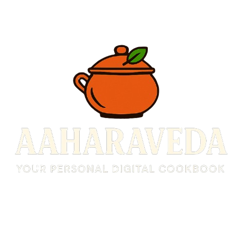

<table>
  <tr>
    <td>

# AAHARAVEDA 🍲 – Digital Cookbook

**Aaharaveda** is a digital cookbook platform where users can organize, save, and explore their favorite recipes all in one place. With a clean UI and customizable categories, it helps food lovers curate their personal kitchen library effortlessly.

</td>
    <td align="right">
      
    </td>
  </tr>
</table>

---

## 🛠 Tech Stack

- **Frontend**: React.js  
- **Backend**: Node.js, Express.js  
- **Database**: MySQL  
- **UI Libraries**: Chakra UI, Material UI, Mantine, DaisyUI, Bulma  
- **Tools & Components**:  
  - Material React Table  
  - React Quill (Rich Text Editor)  
  - React Router  
  - React CSS Modules  

---

## 🚀 How to Run Locally
<h2 style='width:100%;text-align:center'>How To Use</h2>

- Clone this Repo
- Install Dependencies inside of the "/app" directory from the root project

  ```bash
  cd app && npm install
  ```
  
- Install Dependencies inside of the "/server" directory from the root project

  ```bash
  cd server && npm install
  ```
  
- Setup the MySQL Server on your local computer using this link: https://dev.mysql.com/doc/mysql-getting-started/en/

- Add `env` file in the root folder of the "/server" directory:

  ```bash
  DB_HOST=localhost
  DB_USER=root
  DB_PASSWORD=password
  DB=my_db
  ```
- Add `env` file in the root folder of the "/app" directory:

  ```bash
  VITE_API_DOMAIN=https://example-api-domain.com
  ```

- Run Development Server using the same command inside of the "/app" to start the front-end

  ```bash
  npm run dev
  ```
  
  
- Run Development Server using the same command inside of the "/server" to start the backend-end

  ```bash
  npm run dev
<p align="center"><i>Curated with love for foodies and coders alike 🍽️</i></p> 
